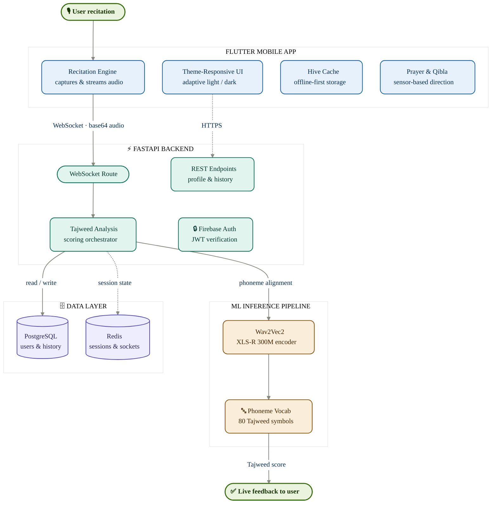

<h1 align="center">🕌 Tilawah AI</h1>

<p align="center">
  <strong>AI-Powered Quran Recitation Correction with Tajweed Analysis</strong>
</p>

<p align="center">
  <a href="#-features"></a>
  <a href="#-quick-start"></a>
  <a href="#-api--websocket-reference"></a>
</p>

<p align="center">
  
  
  
  
  
  
</p>

<p align="center">
  <em>Recite. Correct. Perfect. — A full-stack AI system that listens to your Quran recitation and provides real-time, word-level Tajweed feedback powered by a fine-tuned Wav2Vec2 (XLS-R 300M) model.</em>
</p>

---

## 📖 Overview

**Tilawah AI** is an end-to-end Quran recitation tutoring and correction platform that combines deep learning speech recognition with detailed Tajweed rule analysis. The system is designed to help users perfect their pronunciation of the Holy Quran through automatic mistake detection. 

The core acoustic model is fine-tuned from [XLS-R 300M](https://huggingface.co/facebook/wav2vec2-xls-r-300m) on a multi-reciter dataset of **~120k samples** (comprising 33 distinct reciters) and utilizes an **80-phoneme vocabulary** representing standard Arabic consonants, vowels, and detailed Tajweed pronunciation rules.

### How It Works

```
┌─────────────┐    WebSocket     ┌──────────────────┐    CTC Decode    ┌──────────────────┐
│  Flutter App │ ──── audio ───► │  FastAPI Backend  │ ──────────────► │  Wav2Vec2 Model  │
│  (Mobile)    │ ◄── results ─── │  + G2P Pipeline   │ ◄── phonemes ── │  (XLS-R 300M)    │
└─────────────┘                  └──────────────────┘                  └──────────────────┘
                                         │
                                   ┌─────┴─────┐
                                   │  jiwer     │
                                   │  Alignment │
                                   └─────┬─────┘
                                         │
                                   Per-word Tajweed
                                   feedback + scores
```

1. **Pick a Surah** → Select any verse from the full offline 114-surah Quran text.
2. **Recite verse-by-verse** → Audio is captured on the device and streamed to the backend in real-time over WebSockets.
3. **Inference & CTC Decoding** → The fine-tuned Wav2Vec2 model processes the audio and decodes it into a sequence of phoneme and Tajweed tokens.
4. **Phonetic Sequence Alignment** → The expected Arabic reference text is converted into expected phonemes via a Grapheme-to-Phoneme (G2P) converter, then aligned against the predicted phonemes using `jiwer` sequence alignment.
5. **Tajweed Error Classification** → The system detects mismatches, categorizes mistakes (e.g. Qalqalah, Madd elongation, or basic pronunciation mistakes), and returns word-by-word correctness, error tags, and tips.

---
# 🕌 Tilawah AI — System Architecture

<p align="center"><i>AI-powered Quran recitation practice — real-time Tajweed feedback from a trained Wav2Vec2 model.</i></p>

---



### Legend

| Layer | Color | Responsibility |
|---|---|---|
| 📱 Client | Blue | Flutter UI, audio capture, offline cache, sensors |
| ⚡ Server | Teal | FastAPI routing, auth, Tajweed orchestration |
| 🧠 ML | Amber | Wav2Vec2 inference & phoneme decoding |
| 🗄️ Data | Purple | PostgreSQL persistence, Redis session/socket state |
---

## ✨ Features

### 🎙️ AI Recitation Correction
* **Real-time Streaming**: Low-latency audio streaming via WebSockets.
* **Dual-Level Mistake Detection**:
  * **Clear Mistakes**: Dropped words, letter substitutions, or incorrect diacritics.
  * **Hidden Mistakes**: Missing or incorrect Tajweed rule executions (e.g., incorrect elongation counts, missing qalqalah echo, incorrect Raa/Lam heavy/light characteristics).
* **Word-Level Accuracy & Scores**: Clear visual grading (Correct, Incorrect, Skipped) for each word, along with an overall recitation similarity score.
* **On-Demand Repetition**: Retry or correct individual verses mid-session.

### 📖 Quran Reader
* **Offline Access**: Complete 114-surah offline Quran text (`quran_complete.json`).
* **Visual Tajweed Rules**: Text is rendered in Tanzil Uthmani script with color-coded Tajweed diacritics.
* **Premium Typography**: Built using the high-quality Scheherazade New Arabic typeface.

### 🕐 Islamic Tools
* **Prayer Times Calculator**: Localized prayer time calculations based on device GPS location.
* **Qibla Finder**: Device compass-based Qibla direction finder.

### 📊 Progress Tracking
* **Daily Streaks & XP**: Gamified daily practice goals and experience points to encourage consistency.
* **Session History**: Detailed reports highlighting previous performance, accuracy trends, and persistent mistakes.
* **Dark & Light Themes**: Responsive UI layout supporting system dark and light modes.

---

## 🛠️ Tech Stack

<details>
<summary><strong>Backend</strong> — Python / FastAPI</summary>

| Component | Technology |
| :--- | :--- |
| **Framework** | FastAPI 0.109+ with Uvicorn (HTTP & WebSocket) |
| **Database ORM** | SQLAlchemy 2.0 + Alembic (Migrations) |
| **Authentication** | JWT (`python-jose`), bcrypt (`passlib`), Firebase Admin SDK |
| **Session Cache** | Redis (with local fallback) |
| **Rate Limiter** | slowapi |
| **Audio Processing** | soundfile, pydub, imageio-ffmpeg, librosa (16kHz resampling) |
| **Tajweed G2P** | Custom G2P, `jiwer` sequence alignment, `pyarabic` |

</details>

<details>
<summary><strong>Frontend</strong> — Flutter / Dart</summary>

| Component | Technology |
| :--- | :--- |
| **Framework** | Flutter 3.2+ (Dart) |
| **State Management** | Riverpod |
| **Navigation** | go_router |
| **API Client** | Dio (with interceptors for JWT injection) |
| **Audio Streaming** | record (mic capture), just_audio (CDN playback) |
| **Data Storage** | Hive, flutter_secure_storage |
| **Auth Client** | Firebase Auth + Firebase Core |
| **UI Components** | Google Fonts (Scheherazade New), Lottie, Shimmer, flutter_animate |

</details>

<details>
<summary><strong>Training Pipeline</strong> — HuggingFace / PyTorch</summary>

| Component | Details |
| :--- | :--- |
| **Base Model** | `facebook/wav2vec2-xls-r-300m` (CTC architecture) |
| **Framework** | PyTorch 2.4+, HuggingFace Transformers 4.40+ |
| **Dataset** | ~120k WAV samples (EveryAyah corpus, 33 reciters) |
| **Vocabulary** | 80-phoneme mapping (standard consonants + custom Tajweed markers) |
| **Metrics** | PER (Phoneme Error Rate), WER (Word Error Rate), jiwer |

</details>

<details>
<summary><strong>Infrastructure & Ops</strong></summary>

* **Docker**: Containerized execution via `docker-compose` (FastAPI + PostgreSQL 15 + Redis 7).
* **CI/CD**: GitHub Actions workflows running automated tests and quality checks.

</details>

---

## 🚀 Quick Start

### Prerequisites

| Component | Version | Notes |
| :--- | :--- | :--- |
| **Python** | 3.11+ | Backend execution runtime |
| **Flutter SDK** | 3.2+ | Mobile application environment |
| **ffmpeg** | Latest | Required for backend audio format conversions |
| **GPU (NVIDIA)** | Optional | Highly recommended for training; CPU is sufficient for inference |

### 1. Backend Setup

From the `backend` directory:

```bash
# Create and activate virtual environment
python -m venv .venv
source .venv/bin/activate        # Linux/macOS
# .venv\Scripts\activate         # Windows

# Install python dependencies
pip install -r requirements.txt

# Configure environment variables
cp .env.example .env
# Edit .env and customize DATABASE_URL and JWT_SECRET_KEY

# Upgrade database migrations (for PostgreSQL setups)
alembic upgrade head

# Start the server locally
python run.py
# Server will run at http://0.0.0.0:8000
```

### 2. Frontend Setup

From the `frontend` directory, make sure an emulator or target device is connected:

```bash
# Fetch Dart dependencies
flutter pub get

# Check setup
flutter doctor

# Run application
flutter run
```

### 3. Model Checkpoint

To enable AI speech recitation grading, download the fine-tuned Wav2Vec2 model weights from the following Google Drive link:

👉 **[Google Drive Model Weights](https://drive.google.com/file/d/1V8ap8FEzSXxfqufCke3YglPWISyV-wuA/view?usp=sharing)**

Extract and place the model files into the directory:
`backend/models/tajweed_model/`

Then, update your backend `.env` configuration:

```env
MODEL_PATH=models/tajweed_model/final
```

> [!NOTE]
> If `MODEL_PATH` is left blank, the backend falls back to `FallbackCalculatedEngine`, which uses a deterministic audio-energy heuristic. This is useful for testing frontend components without loading the full deep learning model.

### 4. Running with Docker (Production)

Spins up the FastAPI server, a PostgreSQL database, and a Redis session cache container in a unified stack:

```bash
# Run from tilawah-ai directory
docker-compose up --build
# Backend on port 8000 | PostgreSQL on port 5432 | Redis on port 6379
```

---

## ⚙️ Configuration

### Backend Environment Variables (`backend/.env`)

| Variable | Required | Default | Description |
| :--- | :---: | :--- | :--- |
| `DATABASE_URL` | ✅ | `sqlite:///./tilawah.db` | Connection string for database |
| `JWT_SECRET_KEY` | ✅ | — | Secret string for token signatures (≥32 chars in production) |
| `MODEL_PATH` | — | — | Directory path to Wav2Vec2 model weights |
| `REDIS_URL` | — | `redis://localhost:6379` | Connection string for Redis |
| `ENVIRONMENT` | — | `development` | Environment mode (`development` or `production`) |
| `RESEND_API_KEY` | — | — | Api key for sending verification/OTP emails |
| `GOOGLE_CLIENT_ID`| — | — | Google OAuth identification key |
| `SENTRY_DSN` | — | — | DSN string for Sentry application monitoring |

### Frontend Build-Time Variables

Pass backend endpoints via `--dart-define` during the compilation:

```bash
flutter run --dart-define=API_BASE_URL=http://192.168.1.100:8000
```

---

## 📡 API & WebSocket Reference

### REST API Endpoints

| Method | Route | Auth | Description |
| :---: | :--- | :---: | :--- |
| `POST` | `/api/auth/register` | ❌ | Register new account |
| `POST` | `/api/auth/login` | ❌ | Authenticate and get JWT |
| `GET` | `/api/auth/me` | ✅ | Fetch active user information |
| `PUT` | `/api/users/profile` | ✅ | Edit user bio, name, or avatar |
| `GET` | `/api/users/stats` | ✅ | Fetch user statistics (sessions, accuracy, streaks, XP) |
| `GET` | `/api/audio/word/{surah}/{ayah}/{word_index}` | ✅ | Fetch specific word audio clip (cached proxy) |
| `GET` | `/api/audio/demo/audio` | ❌ | Stream demo recitation audio |
| `GET` | `/api/health` | ❌ | Check database, Redis, and model engine status |

### WebSocket Recitation Protocol

**Endpoint:** `ws://localhost:8000/ws/recitation`

1. **Authentication Step**
   * Client sends: `{ "type": "auth", "token": "<JWT_TOKEN>" }`
   * Server responds: `{ "type": "auth_ok", "message": "Authentication successful" }`

2. **Session Initialization**
   * Client sends: `{ "type": "start_session", "surahNum": 1, "ayahNum": 1, "words": ["بِسْمِ", "ٱللَّهِ", ...] }`
   * Server responds: `{ "type": "session_ready", "sessionId": "UUID_STRING" }`

3. **Audio Evaluation**
   * Client sends: `{ "type": "verse_audio", "sessionId": "UUID_STRING", "verseIndex": 1, "expectedWords": [...], "audioBase64": "..." }`
   * Server responds: `{ "type": "verse_result", "overall_score": 92.5, "word_results": [ { "word": "بِسْمِ", "correct": true, "similarity": 0.95, "error_type": null, "tip": null, "rules": ["KASRA"] }, ... ] }`

4. **Session Termination**
   * Client sends: `{ "type": "end_session", "sessionId": "UUID_STRING" }`
   * Server responds: `{ "type": "session_ended", "summary": { ... } }`

---

## 🧠 Model Training details

The local training script (`train_local.py`) fine-tunes Mozilla's base architecture or HuggingFace's `facebook/wav2vec2-xls-r-300m` on the EveryAyah dataset.

```bash
# Execute training run (~120k samples, 15 epochs)
python train_local.py --epochs 15 --max-train 120000

# Smoke test run (quick validation)
python train_local.py --epochs 1 --max-train 1000
```

### Dataset Specifications
* **Dataset Source**: EveryAyah corpus (~120k WAV samples across 33 different reciters, total duration ~547 hours).
* **Phoneme Vocabulary (`vocab_phoneme.json`)**: An **80-phoneme vocabulary** representing Arabic speech and Tajweed rules:
  * **Standard Consonants**: HAMZA, BEH, TEH, THEH, JEEM, HAH, KHAH, etc.
  * **Vowels & Diacritics**: FATHA, KASRA, DAMMA, SUKUN, SHADDA, TANWIN.
  * **Basic Tajweed Rules**: GHUNNA, IDGHAM, IKHFA, MADD (2, 4, 6 counts), QALQALAH, etc.
  * **Advanced rules**: Raa Tafkheem/Tarqeeq, Lam in Allah Tafkheem/Tarqeeq, Waqf stops (MIM, LA, JEEM, QALI, SALI).

---

## 🧪 Testing

### Backend Unit Tests

Run verification tests locally inside the python virtual environment:

```bash
cd backend

# Execute full pytest suite
pytest -v

# Run integrity tests
python run_tests.py
```

### Frontend Widget & State Tests

Execute static analysis and widget tests on Dart code:

```bash
cd frontend

# Run linting check
flutter analyze

# Execute all tests
flutter test
```

---

## ⚠️ Academic & System Limitations

* **Fallback Engine**: Without loading model weights (`MODEL_PATH`), the system falls back to an audio-energy heuristic. This does not perform real ASR but facilitates frontend workflow testing.
* **Speaker Generalization Frontiers**: Although the acoustic model is trained on a multi-reciter dataset (~120k samples, 33 speakers), generalizing studio-quality recordings to noisy "in-the-wild" environments (and non-native, female, or child reciters) remains an active area of research.


---

## 🙏 Credits & Acknowledgments

* [**EveryAyah.com**](https://everyayah.com/) — Multi-reciter audio files and CSV corpus.
* [**Tanzil.net**](https://tanzil.net/) — Standardized Uthmani text.
* [**HuggingFace**](https://huggingface.co/) — Wav2Vec2/XLS-R implementation and transformers APIs.
* [**jiwer**](https://github.com/jitsi/jiwer) — Phoneme error rate tracking and alignments.

<p align="center"><sub>Final Year Project</sub></p>
