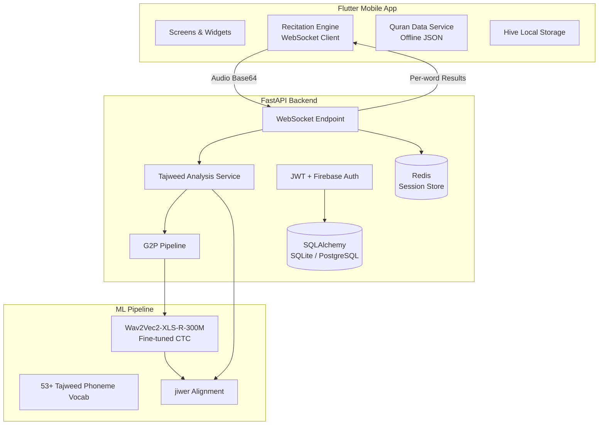

# 🕌 Tilawah AI

**AI-powered Quran recitation correction with Tajweed analysis**


A full-stack system that listens to a user's Quran recitation and gives real-time, word-level Tajweed feedback, powered by a fine-tuned Wav2Vec2 (XLS-R 300M) model.

**Final Year Project** — submitted in partial fulfillment of a Bachelor's degree.

---

## Overview

Tilawah AI fine-tunes [XLS-R 300M](https://huggingface.co/facebook/wav2vec2-xls-r-300m) on ~120k Quranic audio samples labeled with 53+ custom Tajweed phoneme tokens — covering rules like Ghunna, Idgham, Ikhfa, Madd, and Qalqalah.

### How It Works

```
┌─────────────┐    WebSocket     ┌──────────────────┐    CTC Decode    ┌──────────────────┐
│ Flutter App │ ──── audio ───► │  FastAPI Backend │ ──────────────► │  Wav2Vec2 Model  │
│ (Mobile)    │ ◄── results ─── │  + G2P Pipeline  │ ◄── phonemes ── │  (XLS-R 300M)    │
└─────────────┘                  └──────────────────┘                  └──────────────────┘
                                         │
                                   ┌─────┴─────┐
                                   │  jiwer    │
                                   │ Alignment │
                                   └─────┬─────┘
                                         │
                                  Per-word Tajweed
                                  feedback + scores
```

1. **Pick a Surah** — full 114-surah Quran text (Tanzil Uthmani script with diacritics).
2. **Recite verse by verse** — audio streams to the backend over WebSocket in real time.
3. **The model processes it** — Wav2Vec2 decodes audio into Tajweed phoneme tokens, aligned against the expected sequence via `jiwer`.
4. **Instant feedback** — each word marked correct or incorrect, with the specific Tajweed rule and a short tip.

---

## Features

**AI Recitation Correction**
Real-time speech recognition over WebSocket, word-level accuracy scoring, Tajweed rule violation detection, phoneme-level alignment, and on-demand correction mid-session.

**Quran Reader**
Full 114-surah offline text, Tajweed color-coded rendering, Uthmani script with diacritics, Scheherazade New Arabic typography.

**Islamic Tools**
Prayer times based on device GPS, Qibla compass direction finder.

**Progress Tracking**
Daily streak and XP system, session history, dark/light themes.

---

## Architecture



---

## Tech Stack

<details>
<summary><strong>Backend</strong> — Python / FastAPI</summary>

| Layer | Technology |
|:---|:---|
| Framework | FastAPI 0.109+ with Uvicorn |
| ML Model | Wav2Vec2ForCTC (XLS-R 300M), PyTorch 2.4+, Transformers 4.40+ |
| Real-time | WebSocket via `websockets` 12+ |
| Database | SQLAlchemy 2.0 + Alembic (SQLite dev / PostgreSQL prod) |
| Auth | JWT (`python-jose`), bcrypt (`passlib`), Firebase Admin SDK |
| Session Store | Redis (with in-memory fallback) |
| Audio | soundfile, pydub, imageio-ffmpeg, librosa (16kHz resampling) |
| Tajweed | Custom G2P pipeline, jiwer phoneme alignment, pyarabic |
| Rate Limiting | slowapi |
| Monitoring | Sentry SDK (optional) |

</details>

<details>
<summary><strong>Frontend</strong> — Flutter / Dart</summary>

| Layer | Technology |
|:---|:---|
| Framework | Flutter 3.2+ (Dart) |
| State | Riverpod |
| Navigation | go_router |
| HTTP | Dio with JWT interceptor |
| WebSocket | web_socket_channel |
| Audio | record (mic capture), just_audio (playback) |
| Storage | Hive, flutter_secure_storage |
| Auth | Firebase Auth + Firebase Core |
| UI | Google Fonts (Scheherazade), Lottie, Shimmer, flutter_animate |
| Quran Text | Offline JSON — Tanzil Uthmani (`quran_complete.json`) |

</details>

<details>
<summary><strong>Training Pipeline</strong> — HuggingFace / PyTorch</summary>

| Component | Details |
|:---|:---|
| Base Model | `facebook/wav2vec2-xls-r-300m` |
| Training | HuggingFace Trainer, CTC loss |
| Dataset | ~120k WAV samples (EveryAyah, Abdulsamad reciter) |
| Phoneme Vocab | 53+ custom Tajweed tokens (Qalqalah, Madd variants, Noon/Meem rules) |
| Evaluation | PER (Phoneme Error Rate), WER, jiwer |

</details>

<details>
<summary><strong>Infrastructure</strong></summary>

- Docker + docker-compose (PostgreSQL 15, Redis 7)
- GitHub Actions CI (`pytest` on push/PR)
- Separate dev and production Dockerfiles

</details>

---

## Project Structure

```
DeepSpeech-Quran/
├── backend/
│   ├── app/
│   │   ├── main.py                  # FastAPI entry point, lifespan events
│   │   ├── core/                    # Config, DB, security, audio utils, Redis
│   │   ├── models/                  # SQLAlchemy ORM models (User, Session)
│   │   ├── routers/                 # REST endpoints (auth, users, audio)
│   │   ├── schemas/                 # Pydantic request/response schemas
│   │   ├── services/                # Tajweed analysis, G2P, rule detection
│   │   └── websocket/               # Real-time recitation WebSocket handler
│   ├── data/                        # Quran text JSON, audio cache
│   ├── models/tajweed_model/        # Fine-tuned Wav2Vec2 weights (gitignored)
│   ├── tests/                       # pytest suite
│   ├── alembic/                     # DB migrations
│   ├── requirements.txt
│   ├── Dockerfile / Dockerfile.prod
│   └── .env.example
│
├── frontend/
│   ├── lib/
│   │   ├── main.dart                # App entry, Firebase & Hive init
│   │   ├── config/                  # Routes, themes, providers
│   │   ├── core/                    # API client, local storage
│   │   ├── features/                # Auth & recitation state management
│   │   ├── screens/                 # All app screens
│   │   ├── services/                # Quran data, prayer time services
│   │   └── widgets/                 # Reusable UI components
│   ├── assets/                      # Quran JSON, fonts, images
│   └── pubspec.yaml
│
├── docker-compose.yml               # Backend + PostgreSQL + Redis
├── .github/workflows/               # CI pipeline
└── train_local.py                   # Model training script
```

---

## Quick Start

### Prerequisites

| Requirement | Version | Notes |
|:---|:---|:---|
| Python | 3.11+ | Backend runtime |
| Flutter SDK | 3.2+ | Mobile/web frontend |
| ffmpeg | Latest | Audio format conversion |
| NVIDIA GPU | Optional | Recommended for training; inference works on CPU |

### 1. Clone the repository

```bash
git clone https://github.com/Faisal-Riaz-1/DeepSpeech-Quran.git
cd DeepSpeech-Quran
```

### 2. Backend setup

```bash
cd backend

python -m venv .venv
source .venv/bin/activate        # Linux/macOS
# .venv\Scripts\activate         # Windows

pip install -r requirements.txt

cp .env.example .env
# Edit .env — set DATABASE_URL and JWT_SECRET_KEY at minimum

alembic upgrade head             # only needed for PostgreSQL

python run.py
# Server running at http://0.0.0.0:8000
```

### 3. Frontend setup

```bash
cd frontend
flutter pub get
flutter doctor
flutter run
```

### 4. Model weights

The trained Wav2Vec2 checkpoint goes in `backend/models/tajweed_model/` (gitignored). Either train it yourself (see [Training](#training-the-model)) or copy in an existing checkpoint, then set:

```env
MODEL_PATH=models/tajweed_model/final
```

> Without a model checkpoint, the backend falls back to a deterministic audio-energy heuristic — useful for UI testing, not real speech recognition.

### 5. Docker (all services)

```bash
docker-compose up --build
# Backend → :8000  |  PostgreSQL → :5432  |  Redis → :6379
```

---

## Configuration

### Backend (`backend/.env`)

| Variable | Required | Default | Description |
|:---|:---:|:---|:---|
| `DATABASE_URL` | Yes | `sqlite:///./tilawah.db` | SQLAlchemy connection string |
| `JWT_SECRET_KEY` | Yes | — | JWT signing secret (32+ chars in production) |
| `MODEL_PATH` | No | — | Path to fine-tuned Wav2Vec2 checkpoint |
| `REDIS_URL` | No | `redis://localhost:6379` | Redis connection URL |
| `ENVIRONMENT` | No | `development` | `development` or `production` |
| `RESEND_API_KEY` | No | — | For sending OTP emails |
| `GOOGLE_CLIENT_ID` | No | — | Google OAuth client ID |
| `SENTRY_DSN` | No | — | Sentry error tracking DSN |

### Frontend (build-time)

| Variable | Description |
|:---|:---|
| `API_BASE_URL` | Backend server URL, passed via `--dart-define` |

```bash
flutter run --dart-define=API_BASE_URL=http://192.168.1.100:8000
```

---

## API Reference

### REST

| Method | Endpoint | Auth | Description |
|:---:|:---|:---:|:---|
| POST | `/api/auth/register` | No | Create account |
| POST | `/api/auth/login` | No | Login, returns JWT |
| GET | `/api/auth/me` | Yes | Current user profile |
| POST | `/api/auth/forgot-password` | No | Request OTP |
| POST | `/api/auth/verify-otp` | No | Verify OTP |
| POST | `/api/auth/reset-password` | No | Reset password with OTP |
| GET | `/api/audio/word/{surah}/{ayah}/{word_index}` | Yes | Cached word-by-word audio |
| GET | `/api/audio/demo/audio?surah=1&ayah=1` | No | Demo recitation audio |
| GET | `/api/health` | No | Health check (DB, Redis, model status) |

### WebSocket

**Endpoint:** `ws://localhost:8000/ws/recitation`

```
1. AUTH     →  { "type": "auth", "token": "<JWT>" }
            ←  Auth confirmation

2. START    →  { "type": "start_session", "surahNum": 1, "ayahNum": 1, "words": [...] }
            ←  { "type": "session_ready", "sessionId": "..." }

3. RECITE   →  { "type": "verse_audio", "sessionId": "...", "verseIndex": 1,
                  "expectedWords": [...], "audioBase64": "..." }
            ←  { "type": "verse_result", "words": [
                    { "word": "...", "correct": true,  "score": 0.95, "tajweedRules": ["KASRA"] },
                    { "word": "...", "correct": false, "score": 0.62, "tajweedRules": ["MADD"],
                      "feedback": "Focus on Madd elongation" }
                ] }

4. END      →  { "type": "end_session", "sessionId": "..." }
            ←  Session summary with overall stats
```

---

## Training the Model

```bash
python train_local.py --epochs 15 --max-train 120000   # full run
python train_local.py --epochs 1 --max-train 5000       # smoke test
python train_local.py --output-dir ./checkpoints/my_run --lr 1e-4
```

| Requirement | Details |
|:---|:---|
| Dataset | `data/everyayah_full/` — WAV files + train/dev/test CSVs |
| Vocab | `data/everyayah_full/vocab_phoneme.json` — 53+ Tajweed tokens |
| GPU | 12GB+ VRAM recommended (tested on RTX 4080) |
| Output | `<output-dir>/final/` — model weights + `test_results.json` (PER, WER) |

The phoneme vocabulary encodes standard Arabic phonemes, diacritics, and Tajweed rule markers, e.g. `ALEF`, `BEH`, `FATHA`, `KASRA`, `GHUNNA`, `IDGHAM`, `MADD`, `QALQALAH`.

---

## Testing

```bash
# Backend
cd backend
pytest -v
python run_tests.py        # quick integrity checks

# Frontend
cd frontend
flutter test
flutter analyze
```

Backend tests run automatically on every push/PR to `main` via GitHub Actions.

---

## Known Limitations

| Area | Limitation |
|:---|:---|
| Fallback engine | Without a loaded model, the backend uses an audio-energy heuristic — not real ASR |
| Audio cache | Basic 200MB LRU-style pruning, no background cleanup job |
| Demo endpoint | Uses hardcoded local paths; won't work in containers without volume mounts |
| Web platform | Prayer times & Qibla need HTTPS and device sensors (GPS, compass) |
| Reciter coverage | Model trained on a single reciter (Abdulsamad); multi-reciter generalization untested |
| License | No LICENSE file currently included in this repository |

---

## Data & Third-Party Sources

This project builds on the following external resources, credited here for transparency and academic attribution:

- **Base model:** [`facebook/wav2vec2-xls-r-300m`](https://huggingface.co/facebook/wav2vec2-xls-r-300m), released by Meta AI, fine-tuned for this project on Tajweed-labeled Quranic audio.
- **Training audio:** [EveryAyah.com](https://everyayah.com/) — verse-by-verse Quranic recitation audio (Abdulsamad reciter), used for training and word-audio playback.
- **Quran text:** [Tanzil.net](https://tanzil.net/) — Uthmani script with diacritics, used as ground truth for phoneme alignment and the in-app reader.
- **ML tooling:** [HuggingFace Transformers](https://huggingface.co/) (model training/inference), [jiwer](https://github.com/jitsi/jiwer) (WER/PER alignment).

The Tajweed phoneme vocabulary, G2P pipeline, alignment logic, backend, and frontend are original work developed for this project.

---

<p align="center"><sub>Final Year Project</sub></p>
